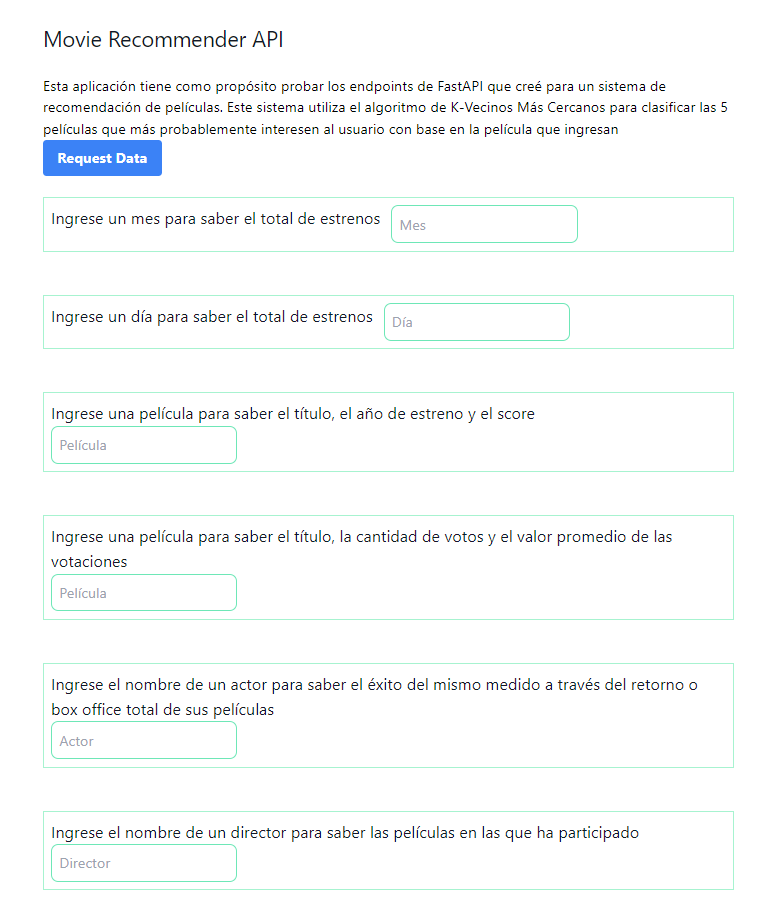

# Movie Recommender App

[Live Demo](https://movie-recommender-app-ejx7.onrender.com/) desplegada en Render.

El objetivo de esta app es poder crear un sistema de recomendación de 5 películas según la película que se ingrese, sin embargo, esta es solo la tarea final.

Uno de los objetivos era poder crear una API usando FastAPI para poder recibir resultados según los parámetros establecidos.Habrán 6 endpoints, los cuales deberán retornar los siguientes datos:

- `cantidad_filmaciones_mes( Mes )`: Se ingresa un mes en idioma Español. Debe devolver la cantidad de películas que fueron estrenadas en el mes consultado en la totalidad del dataset.
                    Ejemplo de retorno: X cantidad de películas fueron estrenadas en el mes de X
- `cantidad_filmaciones_dia( Dia )`: Se ingresa un día en idioma Español. Debe devolver la cantidad de películas que fueron estrenadas en día consultado en la totalidad del dataset.
                    Ejemplo de retorno: X cantidad de películas fueron estrenadas en los días X
- `score_titulo( titulo_de_la_filmación )`: Se ingresa el título de una filmación esperando como respuesta el título, el año de estreno y el score.
                    Ejemplo de retorno: La película X fue estrenada en el año X con un score/popularidad de X
- `votos_titulo( titulo_de_la_filmación )`: Se ingresa el título de una filmación esperando como respuesta el título, la cantidad de votos y el valor promedio de las votaciones. La misma variable deberá de contar con al menos 2000 valoraciones, caso contrario, debemos contar con un mensaje avisando que no cumple esta condición y que por ende, no se devuelve ningun valor.
                    Ejemplo de retorno: La película X fue estrenada en el año X. La misma cuenta con un total de X valoraciones, con un promedio de X
- `get_actor( nombre_actor )`: Se ingresa el nombre de un actor que se encuentre dentro de un dataset debiendo devolver el éxito del mismo medido a través del retorno. Además, la cantidad de películas que en las que ha participado y el promedio de retorno. La definición no deberá considerar directores.
                    Ejemplo de retorno: El actor X ha participado de X cantidad de filmaciones, el mismo ha conseguido un retorno de X con un promedio de X por filmación
- `get_director( nombre_director )`: Se ingresa el nombre de un director que se encuentre dentro de un dataset debiendo devolver el éxito del mismo medido a través del retorno. Además, deberá devolver el nombre de cada película con la fecha de lanzamiento, retorno individual, costo y ganancia de la misma.

Además se tienen dos archivos donde se hace un análisis exploratorio de los datos junto con los archivos donde se hicieron las limpiezas de los datos en bruto. Los archivos con Jupyter Notebooks, los cuales están en la carpeta `Machine Learning Model`, donde los archivos para la limpieza terminan en `_Cleaning.ipynb` y los del análisis exploratorio de datos terminan en `_Analysis.ipynb`.

